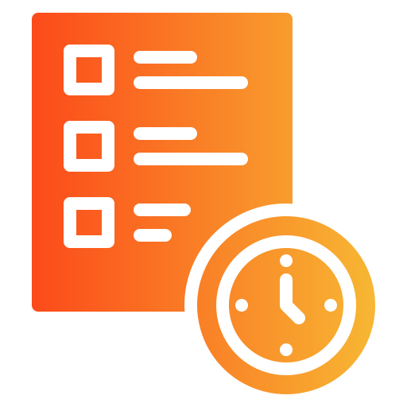

# MSchedule

 

 </a>

<b>MSchedule App</b>
 

## 📄 Giới thiệu

## 💻 Công nghệ 
* Ngôn ngữ: Dart
* Framework: Flutter
* Database: Firebase

## 👨‍💻 Người thực hiện
* Nguyễn Minh Hưng: 20120491

## 🔧 Cài đặt
Tải bản demo của ứng dụng [tại](https://drive.google.com/file/d/1Q6uHuzpmWjfTnLM8-9dGC-BUri70H-Wr/view?usp=sharing)

## 📱 GIao diện

### Splash and Intro UI
</a>
</a>
</a>
</a>

### Sign In and Sign Up
</a>
</a>
</a>

### Home Screen

</a>
</a>

### Calender Screen

</a>
</a>
</a>
</a>
</a>

